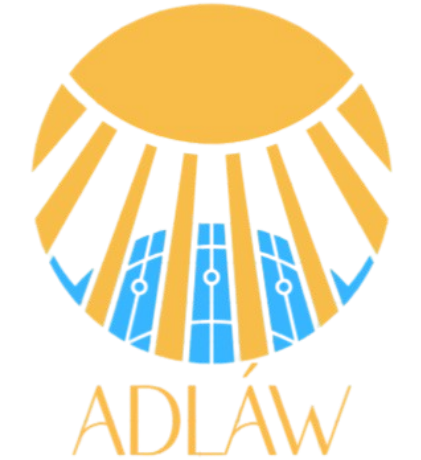

# Adlaw Web Application

  

This is a web application for our design project called "Design of Defective Module Detection for Solar Panel Thermography Analysis System using Deep Learning".

This application is built using FastAPI and Ultralytics YOLOv8. Using Appwrite as the backend service and React as the frontend and Vite as build tool.
